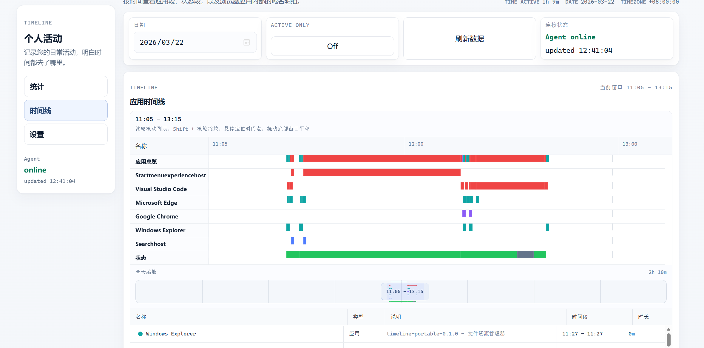
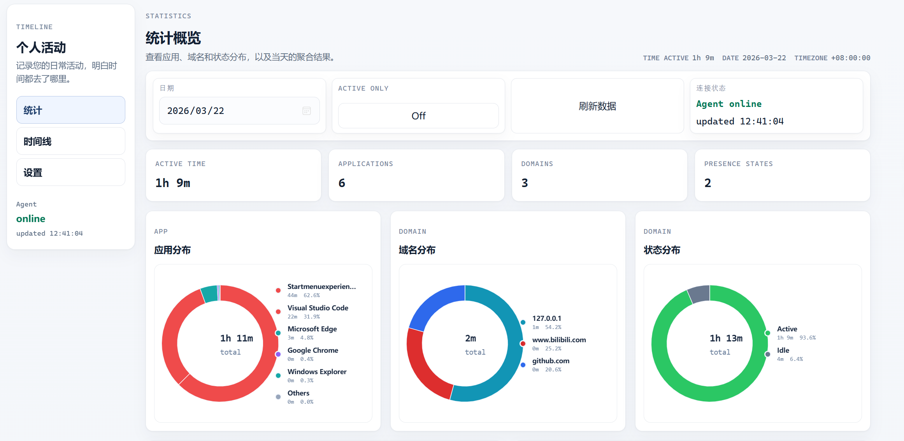

# timeline



Windows 本地个人注意力时间线系统。

这个仓库当前实现的是 MVP 基础骨架，目标是先把本地采集、SQLite 存储、本地 HTTP API、Web UI 和浏览器扩展通信这条最小闭环跑通，再逐步补齐更细的分析能力。

## 当前技术方案

- `apps/timeline-agent`：Rust 本地常驻服务，负责采集、存储和提供 HTTP API
- `apps/web-ui`：React + Vite 的本地网页前端
- `apps/browser-extension`：Edge / Chrome 通用的 Manifest V3 扩展
- `crates/common`：本地服务与前端共享的数据协议
- `docs/`：架构、API、数据表和后续设计说明

## 已完成的基础能力

- Rust + Tokio + Axum + SQLite 的本地服务骨架
- TOML 配置加载、结构化日志、单实例锁
- SQLite 初始化、索引和简单 migration 机制
- Windows 前台窗口轮询采集
- `active / idle / locked` 状态检测与 `presence_segments`
- 浏览器扩展通过本地 HTTP 上报域名事件
- 每日时间线、应用统计、域名统计、专注统计 API
- 中文 Web 仪表盘，支持日期选择和时间线查看

## 快速启动

### 1. 启动本地服务

```powershell
cargo run -p timeline-agent
```

可选配置文件路径：

```powershell
cargo run -p timeline-agent -- --config config/timeline-agent.toml
```

默认会把数据库写到 `data/timeline.sqlite`，监听 `127.0.0.1:46215`。

### 2. 启动前端

```powershell
cd apps/web-ui
npm install
npm run dev
```

开发环境默认从 `http://127.0.0.1:46215` 读取本地 API。

### 3. 加载浏览器扩展

浏览器扩展目录在 `apps/browser-extension`。

- Edge：打开 `edge://extensions`
- Chrome：打开 `chrome://extensions`
- 开启开发者模式
- 选择“加载已解压的扩展程序”
- 指向 `apps/browser-extension`

## 关键隐私边界

- 默认仅记录应用名、进程信息、窗口标题、域名和活跃状态
- 默认不记录页面正文、输入内容、剪贴板和截图
- 所有数据默认只保存在本地 SQLite

## 打包安装包

当前仓库已经提供 Windows 打包脚本，默认会先生成一个“解压后可直接运行”的便携包；如果本机安装了 `Inno Setup 6`，还会额外生成可双击安装的 `.exe` 安装器。

另外，仓库已经提供 GitHub Actions 工作流：

- 手动触发
- 发布 GitHub Release 时自动触发
- Release 触发时会把 `.exe` 和 `.zip` 自动挂到当前 Release 的 assets

### 前置条件

1. 安装 Node.js / npm
2. 安装 Rust toolchain
3. 可选安装 Inno Setup 6

如果 `ISCC.exe` 没有进 PATH，脚本也会尝试从以下默认位置查找：

- `C:\Program Files (x86)\Inno Setup 6\ISCC.exe`
- `C:\Program Files\Inno Setup 6\ISCC.exe`

### 构建打包产物

```powershell
.\scripts\build-installer.ps1
```

脚本会自动完成：

1. 构建 `apps/web-ui/dist`
2. 构建静态 CRT 的 `timeline-agent.exe`
3. 收集浏览器扩展目录
4. 生成一个可直接运行的便携包
5. 如果检测到 `ISCC.exe`，再额外输出 Inno Setup 安装包

输出目录：

- 便携包：`target\installer\output\timeline-portable-<version>.zip`
- 安装包：`target\installer\output\timeline-setup-<version>.exe`

### 便携版布局

- 解压后优先双击 `start-timeline.vbs`，不会弹出终端窗口
- `start-timeline.cmd` 保留为兼容启动方式
- 默认使用包内的 `config\timeline-agent.toml`
- 默认把数据库写到包内的 `data\`
- 包内自带前端静态文件和浏览器扩展目录

### 安装版布局

- 程序安装到 `C:\Program Files\Timeline`
- 用户配置写到 `%LOCALAPPDATA%\Timeline\config\timeline-agent.toml`
- 用户数据写到 `%LOCALAPPDATA%\Timeline\data`
- 浏览器扩展会一起安装到程序目录下的 `browser-extension`
